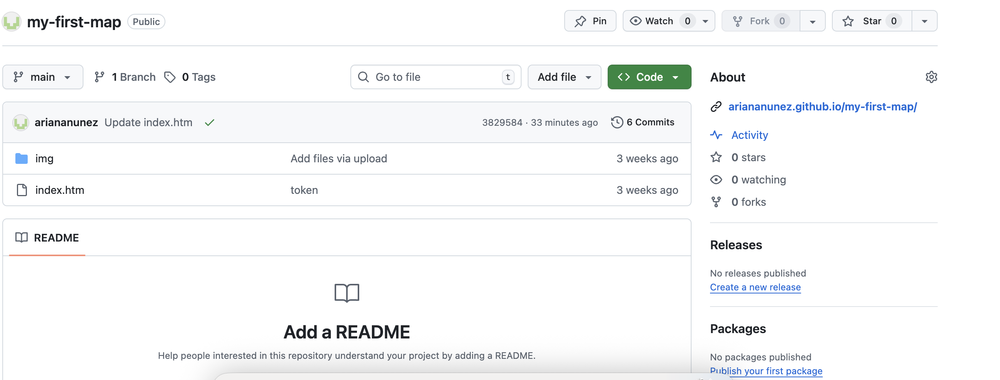

# Ariana's map of important places

## What did I build?

["Ariana's map of important places" App] (https://ariananunez.github.io/my-first-map/) is a   map with markers that has places that are meaningful to me.
Users can...
1. **Toggle through all the maps**, by moving the mouse over location and clicking on the image to see that location. 
2. **Explore each map** by zooming in/out anywhere, rotate the map orientation, or change the pitch (angle).
3. **See the location of each place** (including the state and picture of location) by clicking on the red circle.

Here's a demo:

## Technology

To build this app, I used the following tools:

1. [Google My Maps](https://www.google.com/maps/d/u/0/), to get the coordinate points of each location, and that location is shown on the map.

2. [Mapbox GL JS](https://docs.mapbox.com/mapbox-gl-js/guides) where we got the customization for the map and what we used to create the map.

3. [Visual Studio Code](https://code.visualstudio.com/download) free IDE, with [Live Server](https://marketplace.visualstudio.com/items?itemName=ritwickdey.LiveServer) and [Markdown All in One](https://marketplace.visualstudio.com/items?itemName=yzhang.markdown-all-in-one) extensions.
4. [GitHub pages](https://docs.github.com/en/pages/getting-started-with-github-pages/creating-a-github-pages-site), for publishing the app for free!

## Code Spotlight

One key feature I want to spotlight is publishing my map on github and having the map "show". 

If you click on the link under the "What did I build?" and open it, you'll see that it will take you to the map that I built and you're able to see the location with the images up close. You can then zoom in and out of it and see the globe. This gave me a lot of trouble because there was an error that I did, now here's how I got it to work:

Following the instructions on Mx.Brassey's assignment for uploading my map on github, I was able to do this part of the assignment. I created a repository and used tokens to upload the map. After refreshing the map and fixing the toxens I was able to solve my issue. 

Check it out:

## Contributions

Thank you to @domlet